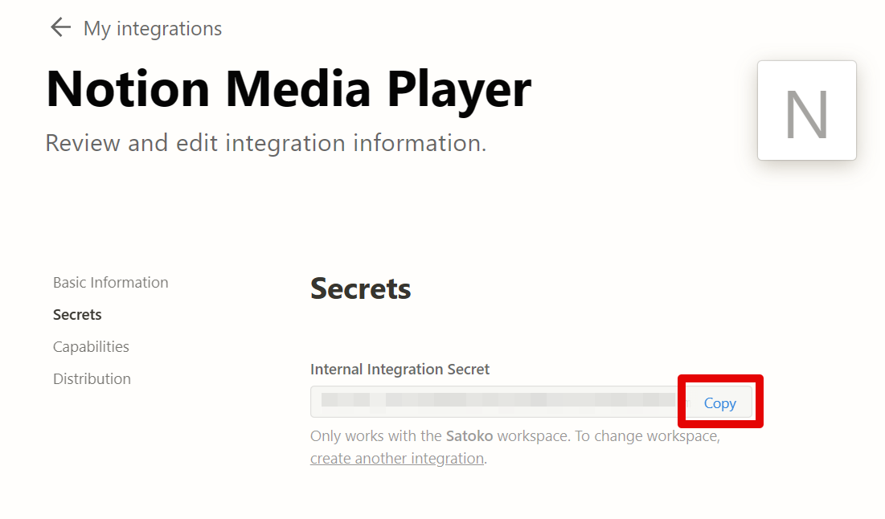

#  Notion Media Player


Notionで管理しているaudioファイルを連続再生するシステムです。

とあるところで、audioファイルを貼り付けたNotionページを特定の人達に公開して共有する運用を行っていたのですが、
「これらを連続再生させたいね」というニーズが出てきたために作りました。

  


サンプル動作環境 → https://notion-media-player.satocheeen.com/  
使用方法 → https://satocheeen.com/resume/notion-media-player/

## 事前準備
### Notionデータベース作成
1. Notionでaudioファイルを管理するデータベースを用意する。  
  audioファイルは以下のようにページ内に貼り付ける。
  

2. URLを参照して、データベースのIDをメモしておく。
  

### Notionインテグレーション作成
1. NtoionAPIを操作するためのインテグレーションを発行する。  
   https://www.notion.so/my-integrations
2. Secretsキーをコピーする
  
3. インテグレーションにNotionデータベースへの参照権限を付与する。
  1. Notionデータベースの右上の「…」をクリック
    
  2. Add connectionsをクリックして、作成したインテグレーションを選択する。
    

NotionAPIに関する情報は、ググれば色々出てくるので、わからないことがあったら適当にググってください。

## サービス構築
Docker Hubにビルドイメージを置いているので、Docker環境のあるサーバ上でコンテナを起動すればサービス構築できます。

docker-compose.yml
```yaml
version: "3"
services:
  main:
    image: satocheeen/notion-media-player:1.0.0
    env_file:
      - ./.env
    ports: 
        - [port]:80
    volumes:
        - [log folder path]:/var/log/www
```

- イメージバージョンは、以下Docker Hubを確認してください。
  https://hub.docker.com/repository/docker/satocheeen/notion-media-player
- .envは[環境変数の設定](#環境変数の設定)を参考にして作成してください。


## 開発環境構築
修正したい場合は、`git clone`して、以下手順を実施。

### 環境変数の設定
1. .env.sampleをコピーして、.env.devを作成する。
    ```
    cd backend
    cp .env.sample .env.dev
    ```
2. 各項目に値を設定する
    |  環境変数名  |  設定値  |
    | ---- | ---- |
    | NOTION_API_KEY | [Notionインテグレーション作成](#notionインテグレーション作成)で取得したNotionインテグレーションのSecretsキー |
    | NOTION_MEDIA_DB_ID | [Notionデータベース作成](#notionデータベース作成)で取得したデータベースID |
    | NOTION_TITLE_PROPERTY_NAME | タイトルとして使用するプロパティ名 |
    | NOTION_SORT_PROPERTY_NAME | 一覧のソートとして用いるプロパティ名 |
    | NOTION_PUBLISH_FLAG_PROPERTY_NAME | Checkboxプロパティ名。Checkboxにチェックがついている項目のみ一覧に表示されます。任意項目。 |
    | LOG_LEVEL | ログ出力レベル。debug, info, warn等。詳細は、[log4js](https://stritti.github.io/log4js/docu/users-guide.html#configuration)参照 |
    | LOG_DIR_PATH | ログ出力先フォルダパス |

### 開発サーバー起動
1. start backend server
   ```
   cd backend
   npm i
   npm run dev
   ```
2. start frontend
   ```
   npm i
   npm start
   ```
3. open http://localhost:3000/ in your browser.

## デプロイ
ソースコードを修正した場合は、以下手順でデプロイする。
1. Dockerイメージ作成
    1. make a Dcoker image
        ```
        docker image build -t notion-media-player .
        ```
    2. operation check
        ```
        docker-compose up -d
        ```
        open http://localhost/ in your browser.
    3. push the Docker image
        ```
        docker image tag notion-media-player xxxx/xxxx:X.X.X
        docker push xxxx/xxxx:X.X.X
        ```
2. Dockerコンテナ起動  
   [サービス構築](#サービス構築)参照。

## Copyright
Copyright (c) 2023 [Satocheeen.com](https://satocheeeen.com)

Released under the MIT license
